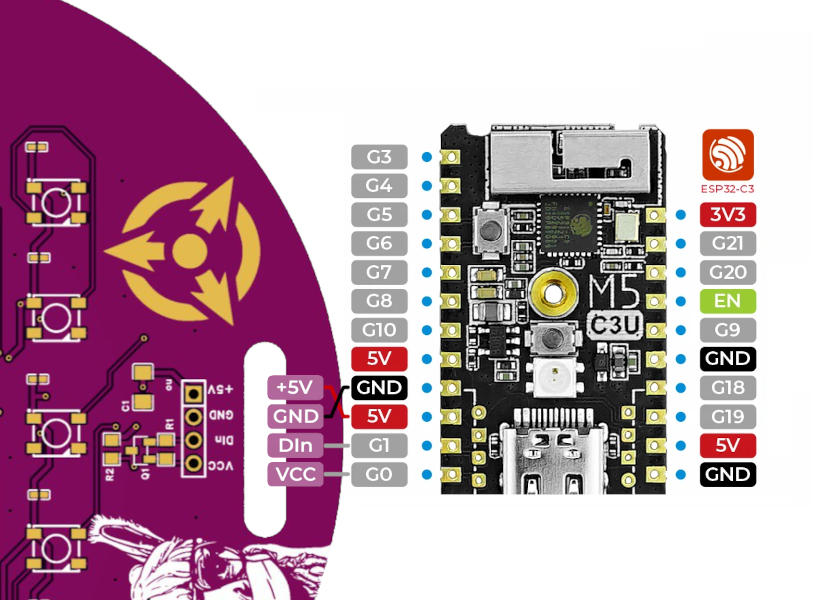

### lux-camp-badge-2023

LuXeria Badge mit Led Matrix.
Der Badge hat keinen Microcontroller drauf. Die Leds können über 4 Pins angesteuert werden.

Um das Anschliessen zu vereinfachen enthält der Badge einen logic level shifter, das heisst egal ob der Microcontroller 5V oder 3.3V für die GPIO pins benutzt, der Badge funktioniert.

#### Pins:
 * **5V**: 5 Volt Spannungsversorgung für die LEDs
 * **GND**: Ground / Erde
 * **DIN**: Signalpin für die WS2812-Led (könen wie "Neopixel" angsteuert werden)
 * **VCC**: Spannung der GPIO-Pins des Microcontrollers (3.3V für ESP32)

*Die Beispielprogramme verwenden üblicherweise GPIO Pin 1 für die Leds:*

#### [Hardware](Hardware/README.md)
 * Schaltplan
 * PCB Design

### Beispiel-Firmware

Wir haben einige Beispielfirmwares geschrieben, welche auf einem ["M5 Stamp C3"](https://docs.m5stack.com/en/core/stamp_c3) micro controller laufen:

#### [C++](CPP/README.md)

Zwei Beispielapplikationen in C++

  * [Simple](CPP/Simple/): Leds ansteuern
  * Advanced: TODO

#### [MicroPython](MicroPython/README.md)

  * [Simple](Micropython/Simple/): Leds ansteuern
  * [Clock](Micropython/Clock/): Eine binäre Uhr

#### [Rust](Rust/README.md)

  * Simple: Leds ansteuern
  * Advanced: TODO